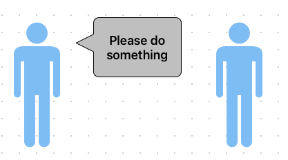
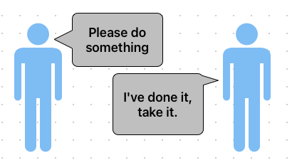

# Akka Interraction patterns

Before we can go much further coding up the blockchain case study in Akka, we need to know about **Akka's interaction patterns**.

The way that actors can communicate with each other. So far, we've actually already been using two different communication patterns in Akka:

1. fire and forget pattern
    - The first of these is the default pattern which is known as fire and forget.
    - when one actor sends a message to another actor and well, that's it. 
    - The sending actor doesn't necessarily expect a response from the recipient.
    - 
    - It's simply the process of sending a message from one actor to another.

2. request-response pattern
    - This is where one actor sends a message to another actor and the second actor sends a message back.
    - This is probably the most used pattern, and we've seen it in both the big primes and the racing examples.
    - 
    - If we take that racing example, the controller sends a message to each of the racers saying where are you? And the racer responds with I'm at this position along the track.
    - To achieve the request-response pattern, all we need to do is ensure that within the request message, we have an ActorRef, a reference to the sender so the recipient can use that to send its reply to it.

3. ask pattern

    - In this section we are going to see other pattern request-adapted response.
    - we haven't yet been able to do is get data out of the Akka system. 
    - That is the main method, the one that is setting up the Akka system and sending the first message to the first actor to tell it to do some work, as right now, got no way of getting any data back from that first actor. The first actor can't tell the main method anything. 
    - In this session we are going to learn how to do that.


## ASK pattern

The Ask Pattern in Akka allows sending a message to an actor and expecting a future response. Unlike the Tell Pattern (`tell`), which is fire-and-forget, `ask` is useful when you need a result from an actor.

### How to Use ask in Akka (Java)

1. An ActorRef (the target actor).
2. A message to send.
3. A timeout (to limit waiting for a response).
4. An execution context (ExecutionContextExecutor for handling the future).


```
        getContext().ask(
                /* The response type that we are expecting */
                ManagerBehavior.Command.class,
                /* The worker reference */
                worker,
                /* The timeout */
                Duration.ofSeconds(5L),
                /* Create the command to send to the worker, similar to the tell method */
                me -> new WorkerBehavior.CalculatePrimeCommand(me),
                /* handleling of the response */
                (response, throwable) -> {
                    if (response != null) {
                        return response;
                    }

                    getContext().getLog().warn("An error occurred while asking for prime number {}", worker.path(), throwable);
                    return new NoResponseReceivedCommand(worker);
                });
```

### 🔥 Key Points:

1. Patterns.ask(actorRef, message, timeout)
   - Sends a message and returns a Future<Object>. 
   - Requires a timeout to avoid waiting indefinitely.

2. Converting Future<Object> to CompletableFuture<Object>
   - Java's CompletableFuture is easier to work with. 
   - Done via PatternsCS.ask().toCompletableFuture(). 
   - Handling the Response (thenAccept)

3. Executes a callback when the response arrives.
   - If there's an error, .exceptionally() handles it.  

---

### ⚡ Ask vs. Tell in Akka

| Pattern       | Behavior                               | Use Case                 |
|---------------|----------------------------------------|--------------------------|
| Tell (`tell`) | Fire-and-forget (no response expected) | Logging, notifications   |
| Ask (`ask`)   | Waits for a response (future-based)    | Querying actors for data |

---
### 🚀 When to Use ask?

- ✅ When you need a result from an actor.
- ✅ When calling actors from outside (e.g., controllers, APIs).
- ✅ When integrating with Java Futures & Streams.