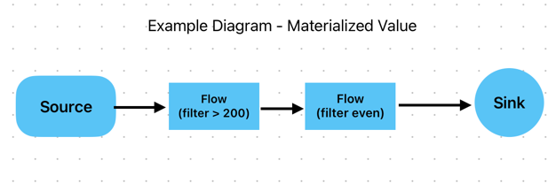

# Materialized Values

The **Materialized Value** it the thirty type of the flow,

```java
 Flow<Integer, BigInteger, NotUsed> flow1ConvertToBigDecimal = Flow.of(Integer.class)
                .map(i -> new BigInteger(2000, ThreadLocalRandom.current()));

        // flow 2 - Flow (to prime + print)
        Flow<BigInteger, BigInteger, NotUsed> flow2FindNextPrime = Flow.of(BigInteger.class)
                .map(bi -> {
                    BigInteger prime = bi.nextProbablePrime();
                    System.out.printf("next prime of %d is %s%n", bi, prime);

                    return prime;
                });
```

**Until now, we have always used the `NotUsed` type. But what does this type really mean, and what is it used for?** 

In Akka Streams, Materialized Values refer to the values that are produced when a stream is materialized (i.e., when it starts running). Every Akka Streams component `Sources`, `Flows`, and `Sinks` can define a materialized value, which can be used to extract useful information from the stream.

## 🔹 Understanding Materialized Values

Each stream component can contribute to the materialized value:

- `Source` can produce a value when the stream starts.
- `Flow` can transform the materialized value.
- `Sink` can produce a result when the stream completes.

However, sometimes a component does not produce a useful materialized value. In these cases, Akka uses the `NotUsed` type.


## 🔹 The Role of NotUsed

`NotUsed` is a placeholder type used when a stream component doesn’t produce any meaningful materialized value. It's equivalent to `Unit` (in Scala) or `Void` (in Java) but specifically designed for Akka Streams.

Example:

```scala
import akka.stream.scaladsl._

val source: Source[Int, NotUsed] = Source(1 to 10)
```

```java
import akka.NotUsed;
import akka.actor.ActorSystem;
import akka.stream.ActorMaterializer;
import akka.stream.Materializer;
import akka.stream.javadsl.*;

public class AkkaStreamExample {
    public static void main(String[] args) {
        // Create an Actor System
        ActorSystem system = ActorSystem.create("MaterializedValuesSystem");
        Materializer materializer = Materializer.createMaterializer(system);

        // Source that emits numbers 1 to 5, but does NOT produce a materialized value
        Source<Integer, NotUsed> source = Source.range(1, 5);

        // Sink that prints each element
        Sink<Integer, NotUsed> sink = Sink.foreach(System.out::println);

        // Run the stream (No meaningful materialized value, so it returns NotUsed)
        source.runWith(sink, materializer);

        // Shutdown system after execution
        system.terminate();
    }
}
```

Here, the Source emits numbers from 1 to 10, but it does not produce any meaningful materialized value, so its type is `Source[Int, NotUsed]`.

## 🔹 Example 1 of Materialized Values

Let's compare a stream with NotUsed and one with a meaningful materialized value:

```scala
import akka.actor.ActorSystem
import akka.stream.scaladsl._
import akka.{ Done, NotUsed }
import scala.concurrent.Future

implicit val system: ActorSystem = ActorSystem("MaterializedValues")

// A Source that does not produce a materialized value (NotUsed)
val source: Source[Int, NotUsed] = Source(1 to 5)

// A Sink that materializes to a Future[Done] (when the stream completes)
val sink: Sink[Int, Future[Done]] = Sink.foreach[Int](println)

// Connecting Source to Sink and materializing the stream
val materializedValue: Future[Done] = source.runWith(sink)
```
Here:
- source has NotUsed because it does not produce a meaningful materialized value.
- sink produces a Future[Done] when it completes.
- The final materialized value of the stream is the Future[Done].


## Example 2: Using a Materialized Value (CompletionStage<Done>)

Now, let's use a sink that returns a materialized value when the stream completes.

```java
import akka.Done;
import akka.actor.ActorSystem;
import akka.stream.ActorMaterializer;
import akka.stream.Materializer;
import akka.stream.javadsl.*;

import java.util.concurrent.CompletionStage;

public class MaterializedValueExample {
    public static void main(String[] args) {
        ActorSystem system = ActorSystem.create("MaterializedValuesExample");
        Materializer materializer = Materializer.createMaterializer(system);

        // Source emits numbers 1 to 5
        Source<Integer, NotUsed> source = Source.range(1, 5);

        // Sink that returns a CompletionStage<Done> when finished
        Sink<Integer, CompletionStage<Done>> sink = Sink.foreach(System.out::println);

        // Run the stream and capture the materialized value
        CompletionStage<Done> result = source.runWith(sink, materializer);

        // Handle the completion of the stream
        result.thenRun(() -> {
            System.out.println("Stream processing finished!");
            system.terminate();
        });
    }
}

```

🔹 Here, the materialized value is CompletionStage<Done>, which completes when the stream finishes.

## Example 3: Materialized Value from a Flow (Modifying the Value)

If you connect multiple components, the final materialized value depends on how you combine them.

```java
import akka.Done;
import akka.NotUsed;
import akka.actor.ActorSystem;
import akka.stream.Materializer;
import akka.stream.javadsl.*;

import java.util.concurrent.CompletionStage;

public class FlowMaterializedValueExample {
    public static void main(String[] args) {
        ActorSystem system = ActorSystem.create("FlowMaterializedValueExample");
        Materializer materializer = Materializer.createMaterializer(system);

        // Source that emits numbers
        Source<Integer, NotUsed> source = Source.range(1, 5);

        // Flow that multiplies numbers by 2 (does NOT modify the materialized value)
        Flow<Integer, Integer, NotUsed> multiplyFlow = Flow.of(Integer.class).map(x -> x * 2);

        // Sink that prints numbers and returns CompletionStage<Done>
        Sink<Integer, CompletionStage<Done>> sink = Sink.foreach(System.out::println);

        // Connecting source → flow → sink, and running the stream
        CompletionStage<Done> materializedValue = source.via(multiplyFlow).runWith(sink, materializer);

        // Handle the stream completion
        materializedValue.thenRun(() -> {
            System.out.println("Stream completed!");
            system.terminate();
        });
    }
}

```

🔹 Here, the materialized value is still CompletionStage<Done>, even though we added a Flow, because Flows do not modify materialized values unless explicitly designed to do so.

## Key Takeaways
1. `NotUsed` (Unit, Void) is used when a component does not produce a meaningful materialized value.
2. **Materialized values** are produced when the stream is started (materialized).
3. `Sinks` often return useful materialized values (e.g., `CompletionStage<Done>`).
4. `Flows` do not affect materialized values unless explicitly designed to do so.


## Example Diagram 



- [MaterializedValuesApp](src/main/java/io/github/jlmc/MaterializedValuesApp.java)


